[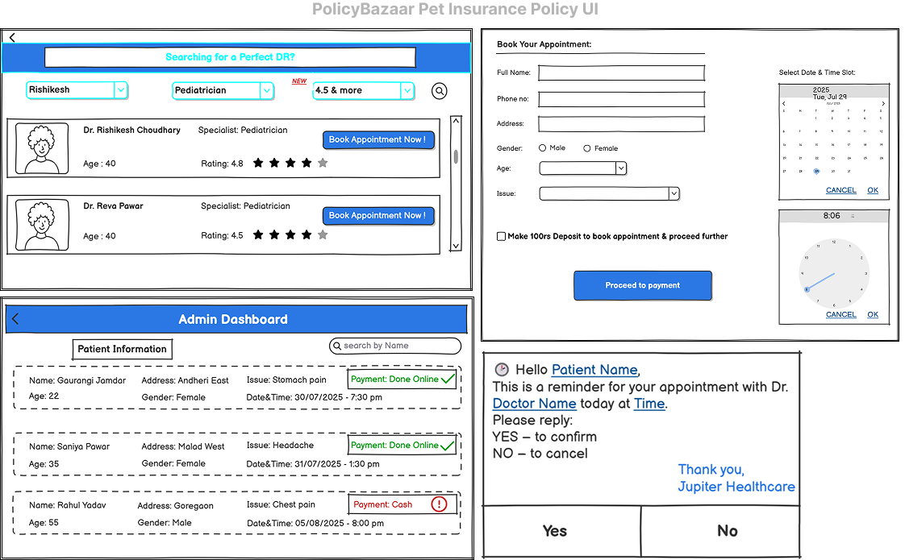](5_Wireframes/Banner.png)

# 🏥 Jupiter Hospital – Appointment Booking System Enhancement

## 📌 Project Overview
This repository captures the **Business Analyst documentation** for enhancing Jupiter Hospital’s digital **Appointment Booking System**. The improvements aim to streamline scheduling, reduce no-shows, and improve billing, communication, and overall patient satisfaction.

---

## ❗ Current Business Problem

While the existing system allows users to register, search doctors, book appointments, and pay online, it lacks critical functionality, leading to:

- Frequent **no-shows**, wasting doctors’ time  
- **Double bookings** and slot conflicts  
- Manual communication overhead  
- Lack of **visit tracking**, affecting care quality  
- No digital **billing or rating** systems  
- **Missed bill payments**, causing revenue loss  

These issues collectively impact doctors, admins, and patients, reducing system effectiveness and user satisfaction.

---

## 💡 Proposed Digital Solution

We propose a robust set of feature enhancements to address these gaps:

- ₹100 refundable appointment deposit  
- Real-time **slot-based booking**  
- **SMS reminders** + call follow-ups + auto-cancel  
- Admin/Doctor dashboards with patient insights  
- **Auto-generated PDF bills**  
- Doctor **ratings and feedback** collection  
- **Incentives**: 10% discount on online payments and 1 free check-up offer  

These changes will significantly improve operations, transparency, and user experience.

---

## 📂 Repository Contents

| # | Folder | Description |
|---|--------|-------------|
| 1 | [**1_BRD**](1_BRD/) | Business Requirements Document |
| 2 | [**2_FRD**](2_FRD/) | Functional Requirements Document |
| 3 | [**3_User_Stories**](3_User_Stories/) | Agile-style user stories |
| 4 | [**4_Use_Cases**](4_Use_Cases/) | Actor-centric use cases |
| 5 | [**5_Wireframes**](5_Wireframes/) | UI mockups of enhanced flows |
| 6 | [**6_Process_Flows**](6_Process_Flows/) | As-Is and To-Be flow diagrams |
| 7 | [**7_Test_Cases**](7_Test_Cases/) | Test case documentation |
| 8 | [**8_RTM**](8_RTM/) | Requirement Traceability Matrix |
| 9 | [**9_Jira**](9_Jira/) | Jira task/storyboard screenshots |
| 10 | [**10_Data**](10_Data/) | Sample data files and tables |

---

## 🧾 Key Business Requirements

### ⭐ Doctor Rating Module
- Search/filter doctors by ratings  
- Show average rating and feedback  
- Doctor card: Name, fees, rating, availability  

### 🗓 Appointment Booking
- Show **real-time available slots**  
- Basic patient form: Name, Age, Gender, Phone, Issue  
- Checkbox for ₹100 **refundable deposit**  

### 📲 Notification & Confirmation
- SMS confirmation request 2 hours prior  
- Auto-call 1 hour before if no SMS response  
- **Auto-cancel** if no response  

### 👨‍⚕️ Admin / Doctor Dashboard
- View patient details & contact  
- Track payment status  
- View medical issue before consultation  

### 💳 Billing & Offers
- **10% discount** on online payments  
- 1 free check-up after X visits  
- Auto-generate downloadable **PDF bills**  

### 🌟 Feedback System
- Rate doctor (1–5 stars)  
- Submit feedback post-visit  

---

## 🖼️ UI Wireframe Previews

> Location: `5_Wireframes/`

- Patient Booking Flow  
  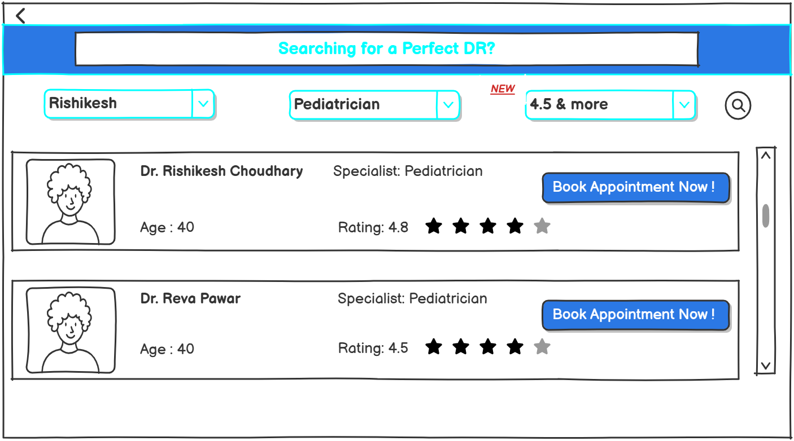  
  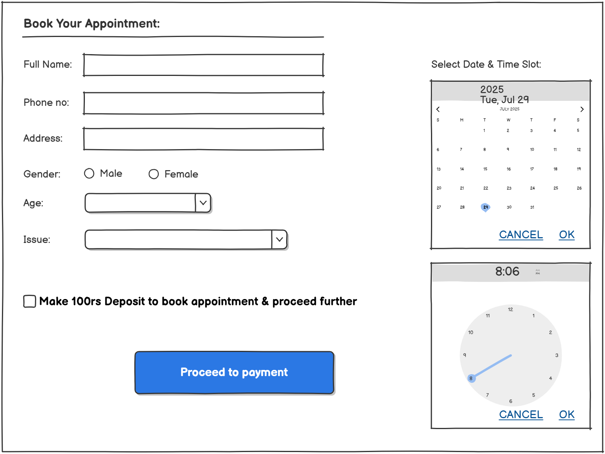  
  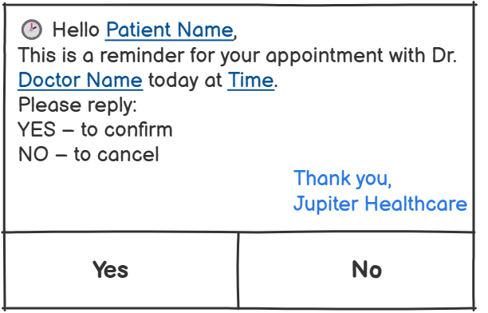  
  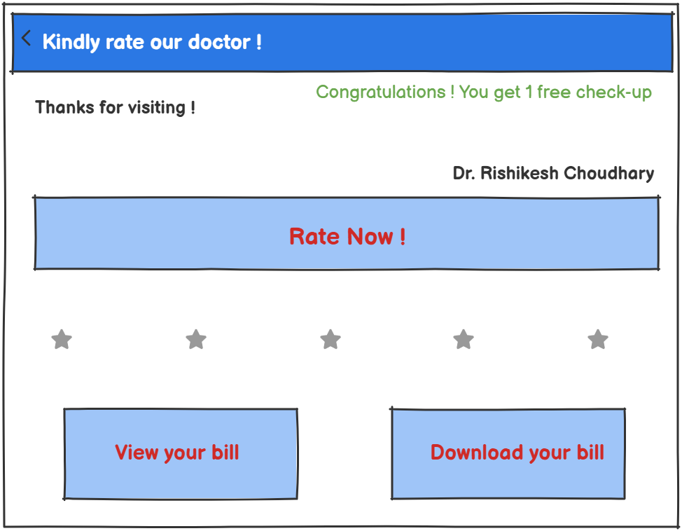  
  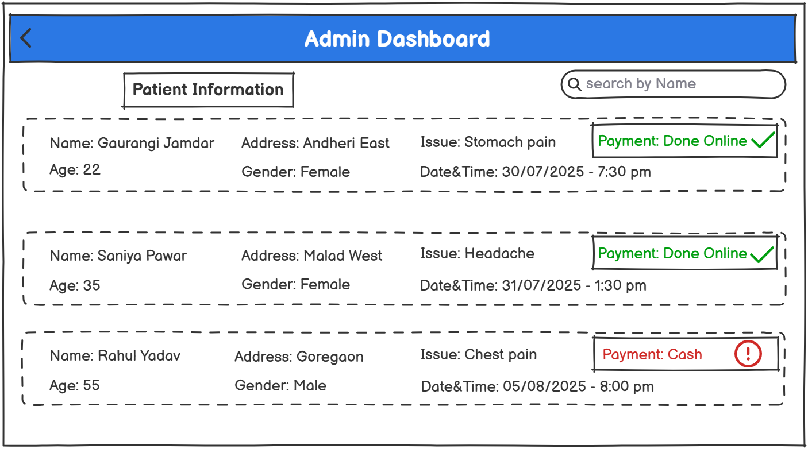  

---

## 🔄 Process Flow Diagrams

> Location: `6_Process_Flows/`

- **Admin – As-Is / To-Be**  
    
  

- **User – As-Is / To-Be**  
  .png)  
  .png)

---

## 🧾 Jira Task & Sprint Documentation

> Location: `9_Jira/`

- Story mapping, sprint planning, and task views  
  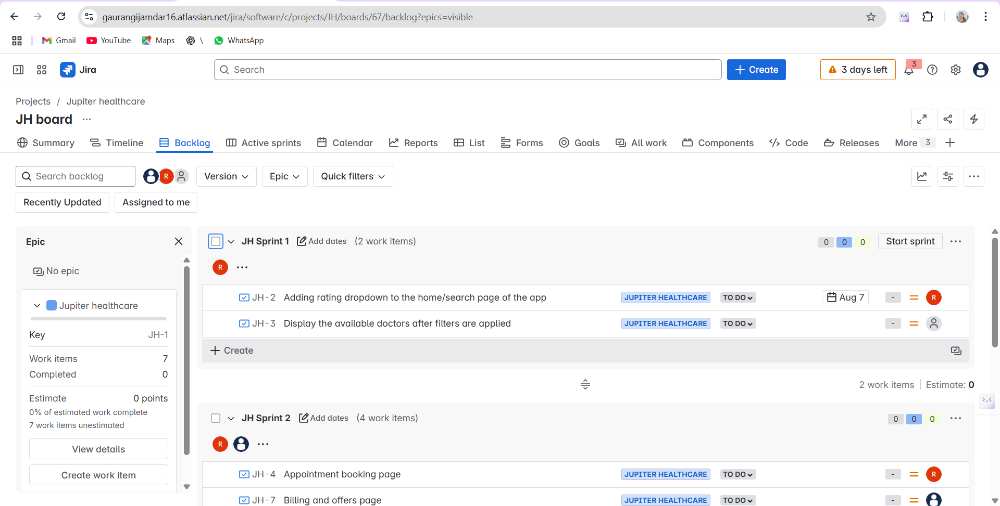  
  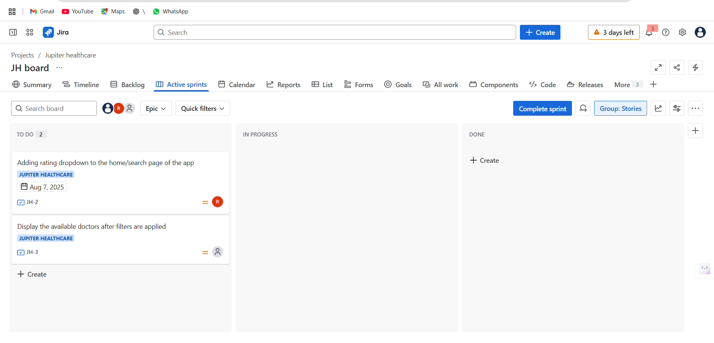  
  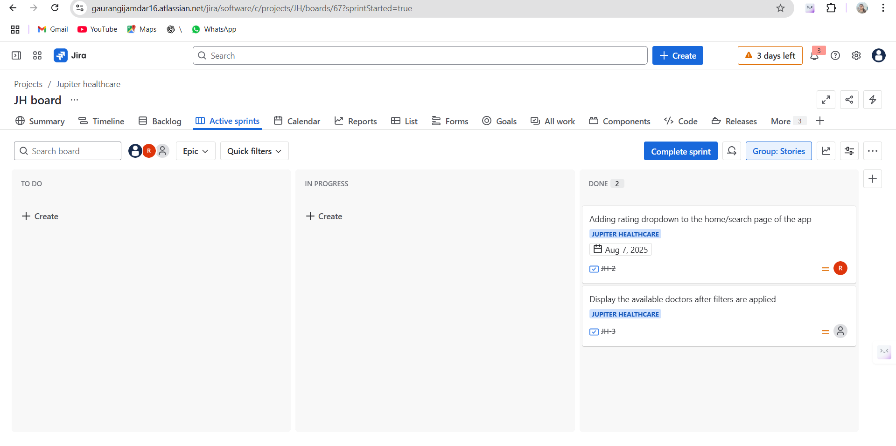  
  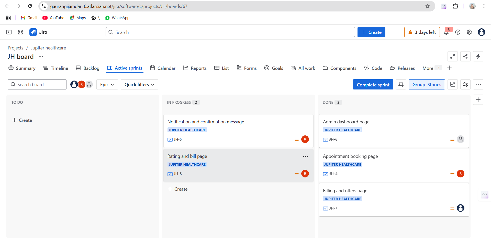  
  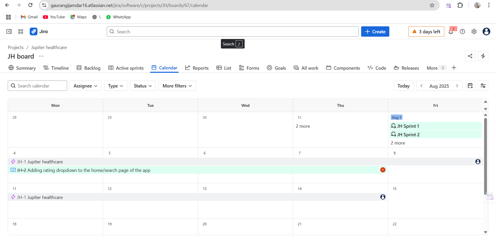  
  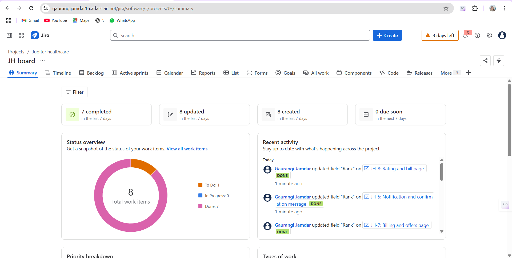  
  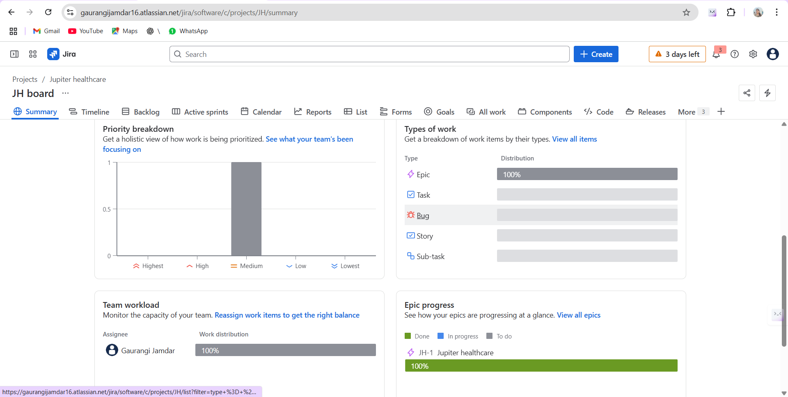

---

## 🛠 Tools Used

- **Documentation:** MS Word, Excel  
- **Wireframes:** Balsamiq / Figma  
- **Flowcharts:** Lucidchart / Visio  
- **Tracking:** Jira  
- **BA Techniques:** MoSCoW, Gap Analysis, SWOT, RTM  

---

## 👩‍💼 About This Project

This is a **comprehensive Business Analyst case study** in the healthcare domain. It covers the full BA workflow from business need identification to system design, validation, and traceability.

This project simulates a **client-facing implementation scenario** and is ideal for portfolios, job interviews, and project demonstrations.

**Author:** GAURANGI JAMDAR  
**LinkedIn:** [GAURANGI JAMDAR](https://www.linkedin.com/in/gaurangi-jamdar-538b4b379)  
**Email:** gaurangijamdar.ba@gmail.com
